# smart-product
Predict category of product by it's description, image and other attributes.

## Content

- [Stack of technologies](#Stack-of-technologies)
- [Proposed solution](#proposed-solution)
- [Process and results](#process-and-results)
- [How to improve?](#how-to-improve)

## Stack of technologies

- Python 🐍
- PyTorch 🔥
- Transformers 🤗
- Timm 🤗+🔥
- Wandb 🪄
- sklearn, metric-learn, imbalanced-learn 🎓

## Proposed solution 🚳:

0. [EDA](#Exploratory-data-analysis) to know the data

1. [Preprocessing dataset](#preprocessing)

2. [get features](#feature-exctraction)

    2.1. feature extractor for images

    2.2. feature extractor for text: descriptions, title and attributes

    2.3. get embeddings for shop title and other fields

3. [perfom](#metric-learning-and-dataset-resampling) metric learning and data resampling

4. [train final classifier](#final-classificator-model)

    4.1. Classic ML model

    4.2. NN classifier

## Process and results

### Exploratory data analysis
(notebooks/EDA_kazan2023.ipynb)

Dataset consists of products that are characterized by it's image, name, description, store and some product attributes. Target value is category of product.

The most important finding of the EDA is that the data are not balanced by class. Some classes are present in a single instance. 

While some fields seemingly are completely undiversified: rating and sale indicator.

Every image has shape (512, 512). All shops and products have titles.

custom_characteristics, defined_characteristics and filters are just dictionaries.

description field in html format

### Preprocessing
(main part in notebooks/TextProcessing_kazan2023.ipynb)

First, I expand text fields in separate columns and in DataFrame column with path to images.
Then, I clean text with nltk.tokenizer and regural expressions. 

Title, description and attributes I join together, because I think that bert can extract more complete information and maybe catch some hidden connection between this fields, than if I gave him separate sentences. So I don't use hard preprocessing technics(lemmatisation and etc) for this fields, because it only make harder for bert to understand category if product.

I tokenized in words shop titles and keys from dictionary-like fields.

For images I prepare transform pipeline before training and feature extraction: Resize to (224, 224), normalisation and for training also augmentation: flip and random rotation.

### Feature exctraction:
#### From images
(notebooks/Image_kazan2023.ipynb)

I used pretrained [beit](https://huggingface.co/microsoft/beit-base-patch16-224-pt22k-ft22k) (Vision Transformer) and [EfficientNet](https://huggingface.co/timm/tf_efficientnetv2_b3.in21k_ft_in1k) for exctracting features from 🤗 transfomers and timm. I also add option for finetuning models in PyTorch🔥. Here are finetuned models for [beit](https://huggingface.co/abletobetable/image_feature_extractor) and [EfficientNet](https://huggingface.co/abletobetable/smart-product-EfficientNet-v1).

Beit plots:

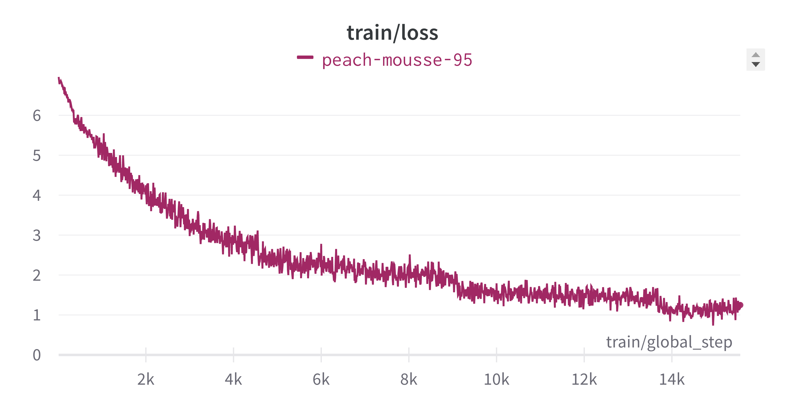 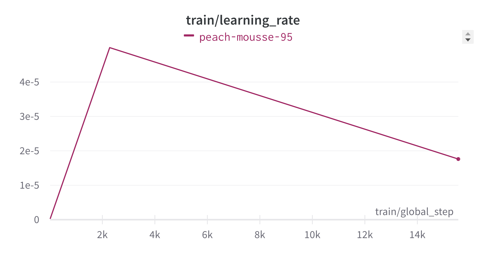 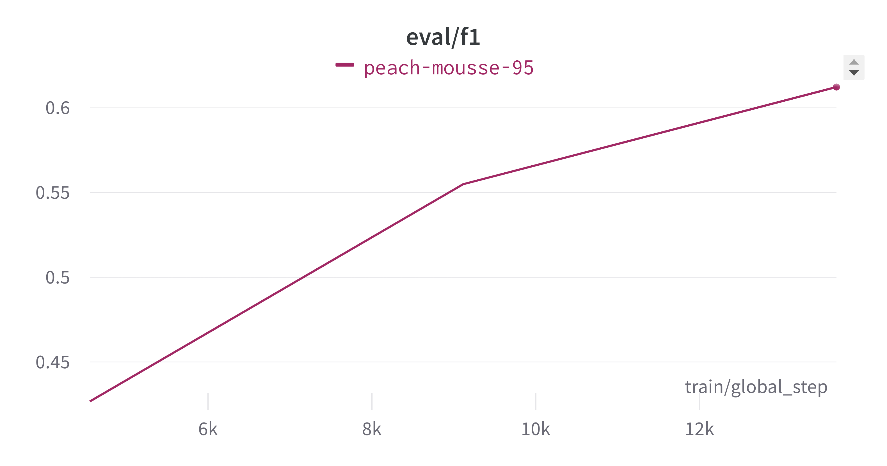

EfficientNet plots:

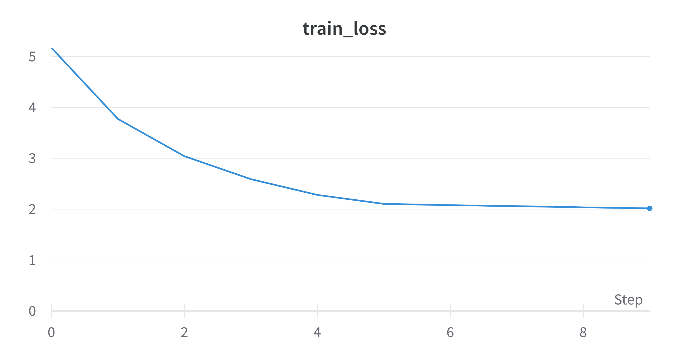 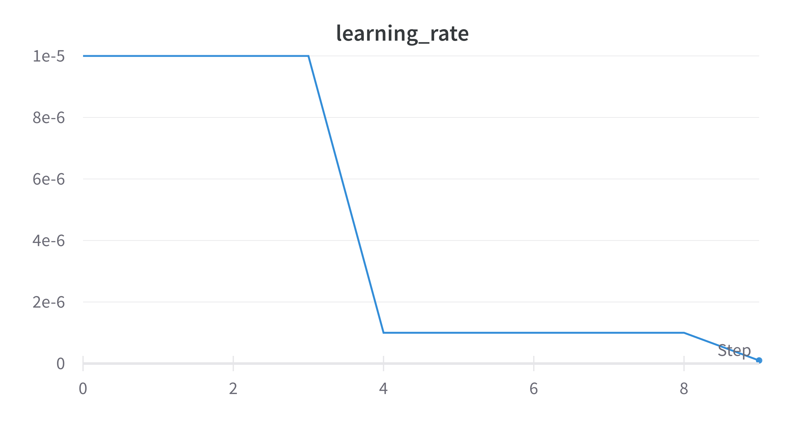 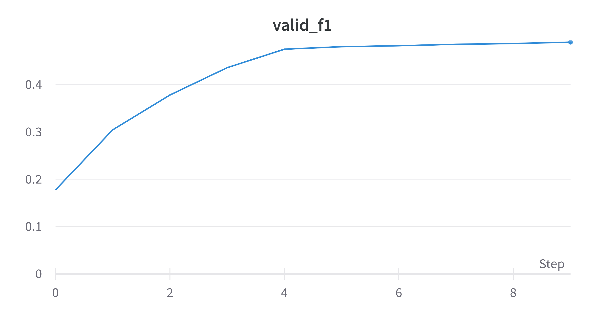

So, training only on images I get eval f1 score 0.61 with beit and 0.49 with EfficientNet. Of course, you can train for longer time with more optimal parameters, but in my case with limit time and gpu access:) this is just fine for prove-of-concept approach.

I extract features with trained nets and not for futher experimenting with both variants.

#### From Text
(notebooks/TextFeaturing_kazan2023.ipynb)

For joined title, description and attributes I decided to take default [russian bert feature extractor](https://huggingface.co/DeepPavlov/rubert-base-cased) from 🤗. As for images I add block for training classification head. Here is finetuned version of [bert](https://huggingface.co/abletobetable/text_feature_extractor).

Bert plot:

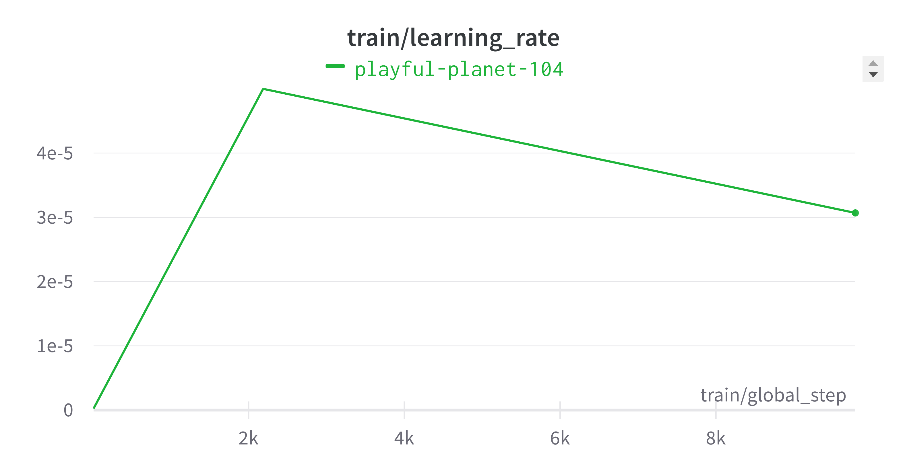 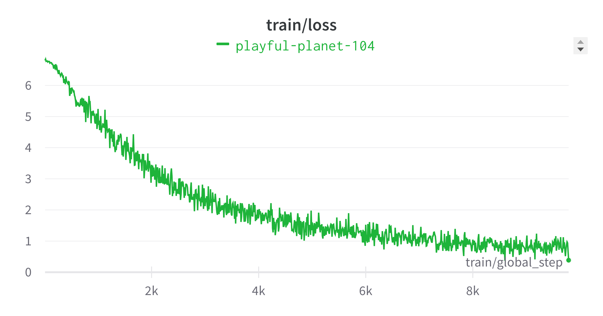

Training only on this type of text I get f1 score 0.7521 on validation set. Of course, you can train for longer time with more optimal parameters, but in my case with limit time and gpu access:) this is just fine for prove-of-concept approach.

For shop titles and other dict-like fields I used [navec](https://github.com/natasha/navec#hudlit)  pretrained emmbeddings with dimension 300, because it's very fast, easy to load and good at perfomance in comparison with FastText and RusVectores. So out is average embedding for sentence. Before calculating embeddings I tokenized text with nltk WordPunctTokenizer.

### Metric learning and dataset resampling
(notebooks/ClassicML_kazan2023.ipynb)

Concatenate all features in one dataset.

At this step I already have different versions of features to train classifer on. Best results, of course, I can reach with trained models. Also beit perfom better than efficientnet. So then I experiment only with trained beit + trained bert + average navec embeddings.

To handle with unbalanced data I used [imbalanced-learn](https://imbalanced-learn.org/stable/) package. I experimented with RandomUnderSampler and RandomOverSampler because it is computationaly free and very fast, but sure you can try Smote, ADASYN and other methods. 

I also transform my data with [LFDA](http://contrib.scikit-learn.org/metric-learn/generated/metric_learn.LFDA.html) (Local Fisher Discriminant Analysis). This algorithm is particularly useful when dealing with multimodality, where one ore more classes consist of separate clusters in input space. So it perfectly suits my task and what is very important LFDA fits very fast.

Using ParameterGrid from sklearn I searched for best combination of upper bound (undersampling), lower bound (oversampling) and dimension after LFDA. Best f1 score: 0.8627 was on validation using KNeighborsClassifier with no undersampling, oversampling up to 16 objects in each class and no reduction but with transform in 2134 dimension.

### Final classificator model

For final model I tried KNeighborsClassifier with data resampling and transformation: f1_score = 0.8627. 

Other ML models works too long or requres a lot of memory capacity. But I experimented with dimension reduction up to 128 and 256 features, so catboost may learn on gpu for an hour with f1 score near 0.85 - 0.86 what is very excited.

Also I trained multilayer perceptron on PyTorch using wandb sweeps🧹 for tuning hyperparameters. As I noticed in MLP better give non transformed data, but I oversampled dataset up to 16.

Hyperparameters tuning 🤖:

I choose random method for running, because with this I can found near optimal parameters much faster than GridSearch.

On the first sweeep run I noticed that Adam optimizer works always better than SGD, so I exclude SGD from searching parameters.

first sweep run:

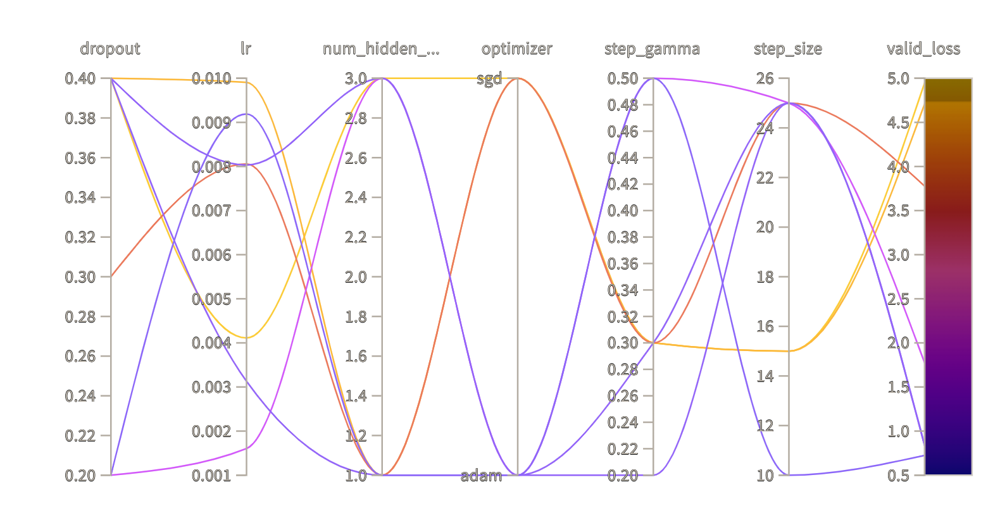
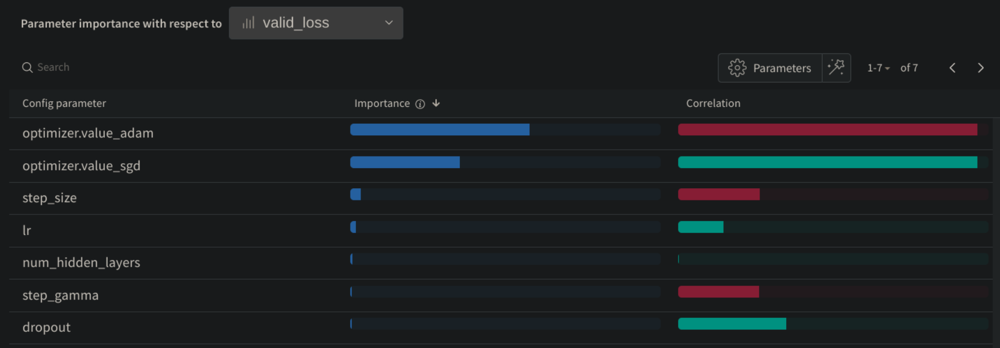

Main sweep run:

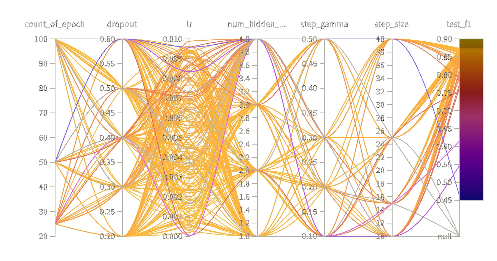
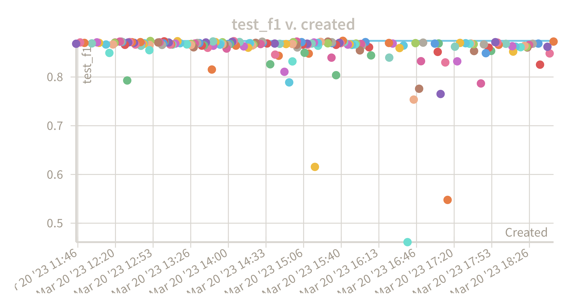
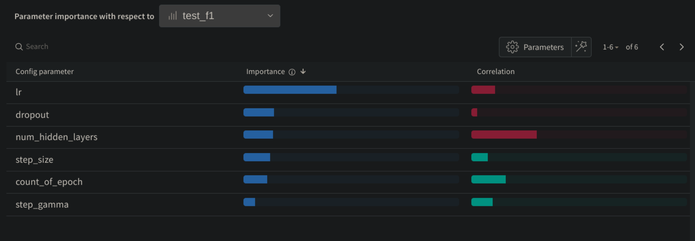

Zoom to best results:

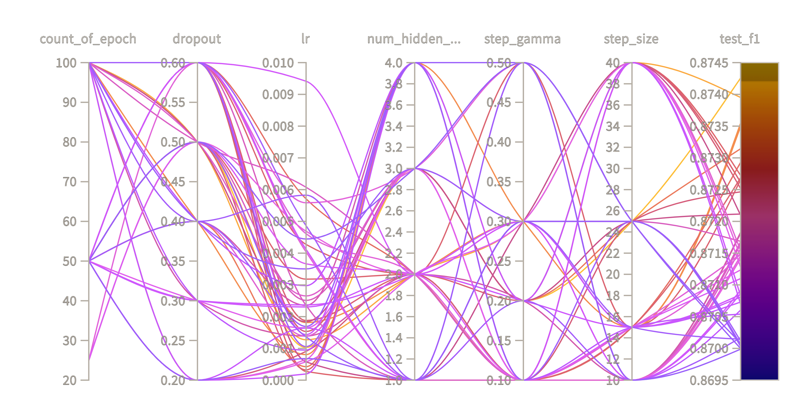
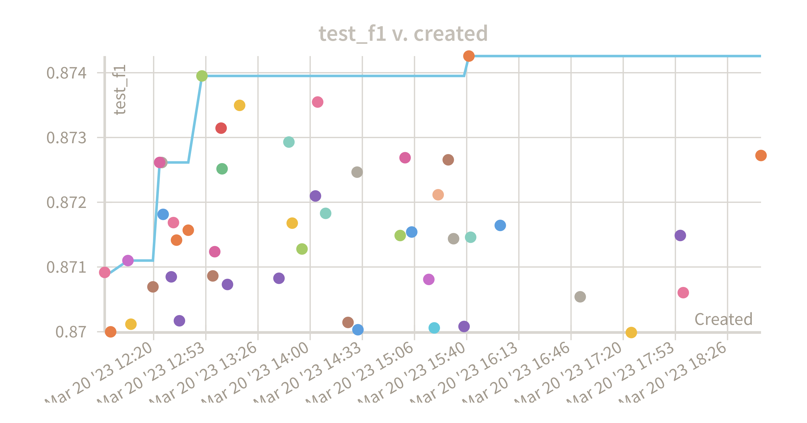

So best params with smaller learning rate, with and bigger dropout. 

For inference model I choose:

    epochs = 50
    batch_size = 4096
    lr = 0.00103
    dropout = 0.5
    num_hidden_layers = 3 
    optimizer = Adam
    scheduler = StepLR
    step_size = 25
    step_gamma = 0.2

❗️ Best f1 score weighted: INSERT_SCORE

## How to improve?
And what could be done more:

    - more features to final dataset 📖:
    Add columns such as sale, ratings. Search for some patterns text fields, parse dict-like columns for more informative features.
    - train more:
    training main feature exctractors (beit and bert) for more epochs, but not just couple, sure make score even higher!
    - adapters:
    add adapters in beit and bert for efficient finetuning and better results
    - multimodal learning:
    make model that can handle images and text at the same time, this might require more computing power
    - metric learning:
    add metric learning in training process by adding metric learning loss, for example using [PML](https://github.com/KevinMusgrave/pytorch-metric-learning).
    - oversampling:
    try other more powerful technics for oversampling, for example, SMOTE or ADASYN.
    - weights for classes:
    apply bigger weights for hard classes to CrossEntropyLoss for more efficient training
    - train again and again 🤹:
    add more params to wandb sweep for auto search for perfect hyperparameters, for example, batch normalisation and bigger dropout values, and execute more runs.

# Feel free to contact with me:

https://t.me/abletobetable

abletobetable@mail.ru